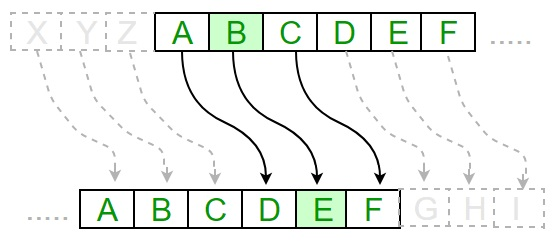

# Шифр Цезаря

Шифр Цезаря – это вид шифра подстановки, в котором каждый символ в открытом тексте заменяется символом, находящимся на некотором постоянном числе позиций левее или правее него в алфавите, т.е. у нас есть у нас есть слово "Zebra" ,то смещая алфавит на 1 букву то получим "Afcsb" 

На математическом языке это будет выглядить так:

Encrypt(mn) = (Q + m_{n} + k) % Q;\
Decrypt(cn) = (Q + c_{n} - k) % Q.\
где m - открытый текст, k - ключ шифрования(кол-во смещений), Q - количество символов в алфавите, c - зашифрованный текст.
